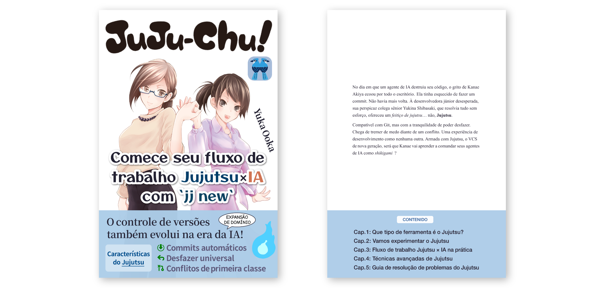

# Repositório de apoio de _Juju-chu! — Comece seu fluxo de trabalho Jujutsu × IA com \`jj new\`_

Este repositório reúne o código de exemplo, a errata e informações sobre atualizações de _Juju-chu! — Comece seu fluxo de trabalho Jujutsu × IA com \`jj new\`_.

 

## ■ Visão geral

_Juju-chu! — Comece seu fluxo de trabalho Jujutsu × IA com `jj new`_ é um guia introdutório completo para o **[Jujutsu](https://www.jj-vcs.dev/)**, um sistema de controle de versão de nova geração compatível com o Git.

O livro explica o modelo mental do Jujutsu a partir de comparações com o Git e mostra como usá-lo no dia a dia com agentes de programação com IA. Também traz dicas práticas e soluções para problemas comuns em projetos reais.

Ao terminar a leitura, você vai estar pronto para usar o Jujutsu nos seus projetos e organizar as mudanças geradas por agentes de IA.

 

## ■ Amostra gratuita

Uma amostra gratuita está disponível para leitura. Dê uma olhada Leia um trecho do livro gratuitamente antes de decidir pela compra..

- [Amostra gratuita em PDF](./jujuchu-sample.pdf)
- [Amostra gratuita em EPUB](./jujuchu-sample.epub)

 

## ■ Onde comprar

### Leanpub

- [Versão PDF/EPUB](https://leanpub.com/juju-chu-pt) (a partir de US$ 12)

### Amazon

- [Versão Kindle](https://www.amazon.com.br/dp/B0HJCYRHWP) (R$ 49)
<!--
- [Capa comum](https://www.amazon.com/dp/B0H82KN1BH) (US$ 18,50) -->

 

## ■ Código de exemplo

Os arquivos de configuração apresentados no livro apresentados no livro está nos seguintes diretórios:

- Exemplos de configuração do Capítulo 3: [`./samples/ch3/`](./samples/ch3/)
- Exemplos de configuração do Capítulo 4: [`./samples/ch4/`](./samples/ch4/)

 

## ■ Errata e atualizações

A edição digital é atualizada conforme necessário. Quando uma nova versão estiver disponível na loja onde você comprou o livro, baixe-a para ter acesso às correções e revisões.

Para consultar as correções e atualizações relevantes para o seu exemplar impresso, confira as informações de edição e impressão no colofão e acesse a página abaixo.

- [Errata e atualizações](./errata.md)

 

## ■ Sumário

#### Prefácio

#### Sobre este livro

#### Prólogo

#### Capítulo 1. Que tipo de ferramenta é o Jujutsu?

- 1-1. O Git combina mal com a programação agêntica?
- 1-2. As características do Jujutsu que se destacam na era da IA
- Coluna: como o Git revolucionou o controle de versão

#### Capítulo 2. Vamos experimentar o Jujutsu

- 2-1. Configurando o Jujutsu
  - 2-1-1. Instalando o Jujutsu
  - 2-1-2. Configuração inicial
- 2-2. Um tour prático pelo Jujutsu
  - 2-2-1. Inicializando um repositório
  - 2-2-2. Verificando o estado do repositório
  - 2-2-3. Trabalhando com changes
  - 2-2-4. Interagindo com um remoto
- 2-3. Os três tipos de log do Jujutsu
  - 2-3-1. O revision log (`jj log`)
  - 2-3-2. O evolution log (`jj evolog`)
  - 2-3-3. O operation log (`jj operation log`)
- 2-4. O modelo mental do Jujutsu
  - 2-4-1. O que é um change?
  - 2-4-2. A diferença entre branch e bookmark
  - 2-4-3. Trabalhando em branches anônimos
- 2-5. Comandos `jj` de uso frequente
- Coluna: as raízes do Jujutsu — que tipo de VCS é o Mercurial?

#### Capítulo 3. Fluxo de trabalho Jujutsu × IA na prática

- 3-1. Coordenando os agentes de IA com o Jujutsu
  - 3-1-1. Fazendo os agentes de IA usarem o Jujutsu
  - 3-1-2. Configuração de Permissions para os comandos `jj`
  - 3-1-3. Rodando `jj fix` via Hooks
- 3-2. Um passo a passo do processo de desenvolvimento Jujutsu × IA
  - 3-2-1. Ajustando a granularidade dos changes criados pela IA
  - 3-2-2. Fazendo push e criando um PR
  - 3-2-3. Desenvolvimento em paralelo com workspaces
- Coluna: as ferramentas que moldaram o Jujutsu, parte 1

#### Capítulo 4. Técnicas avançadas de Jujutsu

- 4-1. Formas engenhosas de especificar os seus alvos
  - 4-1-1. Especificando revisions de forma esperta com revsets
  - 4-1-2. Especificando arquivos de forma esperta com filesets
- 4-2. Comandos práticos de usuário avançado que vale conhecer
  - 4-2-1. `jj absorb`
  - 4-2-2. `jj arrange`
  - 4-2-3. `jj bookmark advance`
- 4-3. Táticas alternativas para os Git hooks
- 4-4. Resolvendo conflitos de forma semiautomática
  - 4-4-1. Mergiraf
  - 4-4-2. Weave
- 4-5. Ferramentas de UI para o Jujutsu
  - 4-5-1. jjui
  - 4-5-2. JJ View
- Coluna: as ferramentas que moldaram o Jujutsu, parte 2

#### Capítulo 5. Guia de resolução de problemas do Jujutsu

- 5-1. FAQ
  - 5-1-1. Comparando com o Git
    - O que o Git faz que o Jujutsu não faz?
    - Não existe um comando merge?
    - Não existe um comando pull?
    - Quero fazer o equivalente ao cherry-pick do Git
  - 5-1-2. Operações e configurações de nicho
    - Dá para verificar o conteúdo de um arquivo num dado ponto sem mover o `@`?
    - Quero dividir um change cronologicamente
    - Não quero logs ou dumps temporários no meu histórico
    - Quero guardar a configuração do Jujutsu de um repositório no próprio repositório
    - Quero renomear um bookmark tracked
  - 5-1-3. Curiosidades sobre o Jujutsu
    - O Jujutsu é um wrapper do Git?
    - Que tipo de pessoa criou o Jujutsu?
    - O que o nome Jujutsu significa — e como se pronuncia?
- 5-2. Resolução de problemas
  - Um push normal vira um force push silenciosamente
  - Aparece um críptico “Error: The working copy is stale”
  - Um change ganhou uma anotação “divergent” sem que eu soubesse
  - O Jujutsu não rastreia meus arquivos de imagem ou vídeo
  - Depois de fazer merge de um PR e fetch, o `@` se perde
  - Apaguei do GitHub um bookmark remoto em que eu ainda estava trabalhando
  - O Claude Code pede permissão para rodar `jj log` mesmo estando em allow
- Coluna: queremos um serviço de hospedagem nativo de JJ!

#### Epílogo

---

© 2026 Yuka Ooka / [Klemiwary Books](https://klemiwary.com/)
